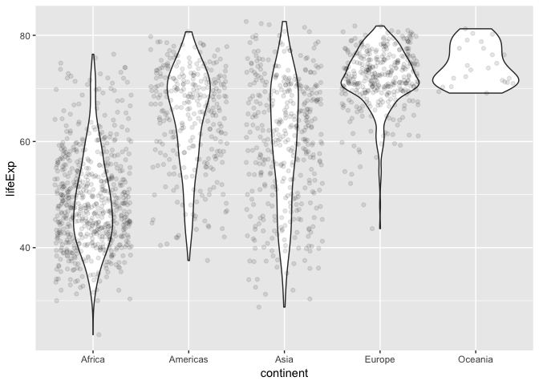

Hw02\_KZ
================

Homework 02: Explore Gapminder and use dplyr
============================================

### In this assignemnt I will be exploring Gapminder and using dplyr

First, I will install the gapminder package (**install.packages("gapminder")**) and the tidyverse package (which contains dplyr)(**install.packages("gapminder")**) in my console, then I will load them in my script

``` r
library(gapminder)
```

``` r
library(tidyverse)
```

    ## ── Attaching packages ────────────────────────────────────────────────────── tidyverse 1.2.1 ──

    ## ✔ ggplot2 3.0.0     ✔ purrr   0.2.5
    ## ✔ tibble  1.4.2     ✔ dplyr   0.7.6
    ## ✔ tidyr   0.8.1     ✔ stringr 1.3.1
    ## ✔ readr   1.1.1     ✔ forcats 0.3.0

    ## ── Conflicts ───────────────────────────────────────────────────────── tidyverse_conflicts() ──
    ## ✖ dplyr::filter() masks stats::filter()
    ## ✖ dplyr::lag()    masks stats::lag()

Checking out the data
---------------------

``` r
?gapminder
```

When I ask R about Gapminder it tell me that Gapminder is an "excerpt of the Gapminder data on life expectancy, GDP per capita, and population by country"

The first thing I like to do when I open a dataset is get a preview of what it looks like. I accomplish this through the **head** and **summary** functions

``` r
head(gapminder)
```

    ## # A tibble: 6 x 6
    ##   country     continent  year lifeExp      pop gdpPercap
    ##   <fct>       <fct>     <int>   <dbl>    <int>     <dbl>
    ## 1 Afghanistan Asia       1952    28.8  8425333      779.
    ## 2 Afghanistan Asia       1957    30.3  9240934      821.
    ## 3 Afghanistan Asia       1962    32.0 10267083      853.
    ## 4 Afghanistan Asia       1967    34.0 11537966      836.
    ## 5 Afghanistan Asia       1972    36.1 13079460      740.
    ## 6 Afghanistan Asia       1977    38.4 14880372      786.

``` r
summary(gapminder)
```

    ##         country        continent        year         lifeExp     
    ##  Afghanistan:  12   Africa  :624   Min.   :1952   Min.   :23.60  
    ##  Albania    :  12   Americas:300   1st Qu.:1966   1st Qu.:48.20  
    ##  Algeria    :  12   Asia    :396   Median :1980   Median :60.71  
    ##  Angola     :  12   Europe  :360   Mean   :1980   Mean   :59.47  
    ##  Argentina  :  12   Oceania : 24   3rd Qu.:1993   3rd Qu.:70.85  
    ##  Australia  :  12                  Max.   :2007   Max.   :82.60  
    ##  (Other)    :1632                                                
    ##       pop              gdpPercap       
    ##  Min.   :6.001e+04   Min.   :   241.2  
    ##  1st Qu.:2.794e+06   1st Qu.:  1202.1  
    ##  Median :7.024e+06   Median :  3531.8  
    ##  Mean   :2.960e+07   Mean   :  7215.3  
    ##  3rd Qu.:1.959e+07   3rd Qu.:  9325.5  
    ##  Max.   :1.319e+09   Max.   :113523.1  
    ## 

What type of an object is this?

``` r
typeof(gapminder)
```

    ## [1] "list"

What is it's class?

``` r
class(gapminder)
```

    ## [1] "tbl_df"     "tbl"        "data.frame"

How many variables/columns?

The **ncol** function tells you how many columns are present while the **nrow** function tells you how many rows are present in your dataset

``` r
ncol(gapminder)
```

    ## [1] 6

``` r
nrow(gapminder)
```

    ## [1] 1704

The **length** function also tells you how many columns are in the gapminder dataset in our case. Techinically it tells you how many "vectors, or factors (indluing lists)"

``` r
length(gapminder)
```

    ## [1] 6

The **dim** function retrieves the dimensions of an object

``` r
dim(gapminder)
```

    ## [1] 1704    6

In our case it tells us that the gapminder dataset is 1704 x 6... aka 1704 rows and 6 columns!

What type of data is each variable? We use the **typeof** function for each column

``` r
typeof(gapminder$pop)
```

    ## [1] "integer"

``` r
typeof(gapminder$lifeExp)
```

    ## [1] "double"

``` r
typeof(gapminder$continent)
```

    ## [1] "integer"

``` r
typeof(gapminder$gdpPercap)
```

    ## [1] "double"

``` r
typeof(gapminder$year)
```

    ## [1] "integer"

``` r
typeof(gapminder$country)
```

    ## [1] "integer"

A lot of the information we just looked at can actually be found in a simpler way, using the **str** function

``` r
str(gapminder)
```

    ## Classes 'tbl_df', 'tbl' and 'data.frame':    1704 obs. of  6 variables:
    ##  $ country  : Factor w/ 142 levels "Afghanistan",..: 1 1 1 1 1 1 1 1 1 1 ...
    ##  $ continent: Factor w/ 5 levels "Africa","Americas",..: 3 3 3 3 3 3 3 3 3 3 ...
    ##  $ year     : int  1952 1957 1962 1967 1972 1977 1982 1987 1992 1997 ...
    ##  $ lifeExp  : num  28.8 30.3 32 34 36.1 ...
    ##  $ pop      : int  8425333 9240934 10267083 11537966 13079460 14880372 12881816 13867957 16317921 22227415 ...
    ##  $ gdpPercap: num  779 821 853 836 740 ...

Next we will explore one **categorical** (*continent*) varibale and one **quantitative** (*lifeExp*) variable
-------------------------------------------------------------------------------------------------------------

Let's start with the **quantitative** variable. For the quantitative variable we will use the **range** function to see what the range in values are for life expectancy

``` r
range(gapminder$lifeExp)
```

    ## [1] 23.599 82.603

The **min** function finds the minimum value, **max** finds the maximum value All of these values can be efficiently found through one simple command: **summary**. Lastly, the **var** function finds the variance and **sd** funtion finds the standard deviation

``` r
min(gapminder$lifeExp)
```

    ## [1] 23.599

``` r
max(gapminder$lifeExp)
```

    ## [1] 82.603

``` r
summary(gapminder$lifeExp)
```

    ##    Min. 1st Qu.  Median    Mean 3rd Qu.    Max. 
    ##   23.60   48.20   60.71   59.47   70.85   82.60

``` r
var(gapminder$lifeExp)
```

    ## [1] 166.8517

``` r
sd(gapminder$lifeExp)
```

    ## [1] 12.91711

For the **categorical** variable we will do a different analysis, starting with the **levels** function. The levels function shows the values within the variable. In this case it shows the countries within the "continent" variable

``` r
levels(gapminder$continent)
```

    ## [1] "Africa"   "Americas" "Asia"     "Europe"   "Oceania"

The **summary** function shows the frequency of each level... in this case it shows how many values each continent has

``` r
summary(gapminder$continent)
```

    ##   Africa Americas     Asia   Europe  Oceania 
    ##      624      300      396      360       24

Exploring various plot types
----------------------------

Next, we will explore some plots. Let's continue with the *continent* and *life expectancy* variables.

If we want to see a simple plot of this *life expectancy* data, we can use the **hist** function

``` r
hist(gapminder$lifeExp)
```


Let's check out a scatterplot of *life expectancy* per *continent*

We will store this in value "a" for convenience

``` r
a <- ggplot(gapminder, aes(continent, lifeExp)) 
```

Let's try it in a scatterplot

``` r
a + geom_point()
```


Box plot?

``` r
a + geom_boxplot()
```


BLUE box plot?

``` r
a + geom_boxplot(fill="blue")
```


Violin plot?

``` r
a + geom_violin() +
  geom_jitter(alpha=0.1)
```



This graph shows us the amount of countries within each continent

``` r
ggplot(gapminder, aes(continent, fill = continent)) +
  geom_bar()
```


Wow! Those plots are neat. However, what if we want to focus on more specific variables? I am going narrow down the results by using the **filter** function. The **filter** function picks cases based in their values. We will also use **piping** to carry down the previous command to the next line.

Here I filter to show the life expencancy in only Asia and Africa in a violin plot, coloured by continent

``` r
gapminder %>% 
  filter(continent == "Asia" | continent == "Africa") %>% 
    ggplot(aes(continent, lifeExp, fill = continent)) +
      geom_violin() +
        geom_jitter(alpha=0.1, aes(colour = continent))
```


To create a "new" data frame with speicifc data I use the **select** function. The **select** function picks variables based on their names

In this example I select the columns *continent, country, lifeExp, year* but I specify that I only want rows from the continent column that include everything except for *Americas* and *Oceania* (note the **!** before the filter statement)

``` r
gapminder %>% 
  select(continent, year, lifeExp) %>% 
    filter(!(continent == "Americas" | continent == "Oceania")) %>% 
      ggplot(aes(x = continent, y = lifeExp, fill = continent)) +
        geom_violin() + 
          geom_jitter(aes(colour = continent), alpha = 0.1)
```


This graph shows how you can play with graph design, including colour and size. The colour shows which continent the data point is from while the size shows how large the population of the country is. By changing the characteristics of the graph you can show many cool effects

``` r
ggplot(gapminder, aes(lifeExp,gdpPercap, color=continent)) +
    geom_point(aes(size=pop)) +
      scale_y_log10()
```


But I want to do more!
----------------------

This does not return a correct result for me. When I look at the gapminder dataset it is clear that there are more than 6 returns each for Rwanda and Afghanistan

``` r
filter(gapminder, country == c("Rwanda", "Afghanistan"))
```

    ## # A tibble: 12 x 6
    ##    country     continent  year lifeExp      pop gdpPercap
    ##    <fct>       <fct>     <int>   <dbl>    <int>     <dbl>
    ##  1 Afghanistan Asia       1957    30.3  9240934      821.
    ##  2 Afghanistan Asia       1967    34.0 11537966      836.
    ##  3 Afghanistan Asia       1977    38.4 14880372      786.
    ##  4 Afghanistan Asia       1987    40.8 13867957      852.
    ##  5 Afghanistan Asia       1997    41.8 22227415      635.
    ##  6 Afghanistan Asia       2007    43.8 31889923      975.
    ##  7 Rwanda      Africa     1952    40    2534927      493.
    ##  8 Rwanda      Africa     1962    43    3051242      597.
    ##  9 Rwanda      Africa     1972    44.6  3992121      591.
    ## 10 Rwanda      Africa     1982    46.2  5507565      882.
    ## 11 Rwanda      Africa     1992    23.6  7290203      737.
    ## 12 Rwanda      Africa     2002    43.4  7852401      786.

When I bring the **%in%** function into the code, it spits out a new result with more returns

``` r
filter(gapminder, country %in% c("Rwanda", "Afghanistan"))
```

    ## # A tibble: 24 x 6
    ##    country     continent  year lifeExp      pop gdpPercap
    ##    <fct>       <fct>     <int>   <dbl>    <int>     <dbl>
    ##  1 Afghanistan Asia       1952    28.8  8425333      779.
    ##  2 Afghanistan Asia       1957    30.3  9240934      821.
    ##  3 Afghanistan Asia       1962    32.0 10267083      853.
    ##  4 Afghanistan Asia       1967    34.0 11537966      836.
    ##  5 Afghanistan Asia       1972    36.1 13079460      740.
    ##  6 Afghanistan Asia       1977    38.4 14880372      786.
    ##  7 Afghanistan Asia       1982    39.9 12881816      978.
    ##  8 Afghanistan Asia       1987    40.8 13867957      852.
    ##  9 Afghanistan Asia       1992    41.7 16317921      649.
    ## 10 Afghanistan Asia       1997    41.8 22227415      635.
    ## # ... with 14 more rows
